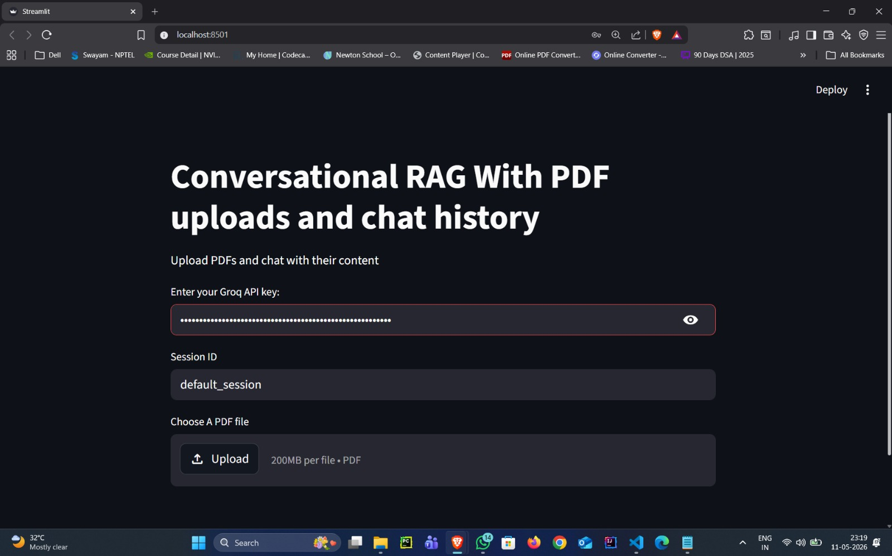
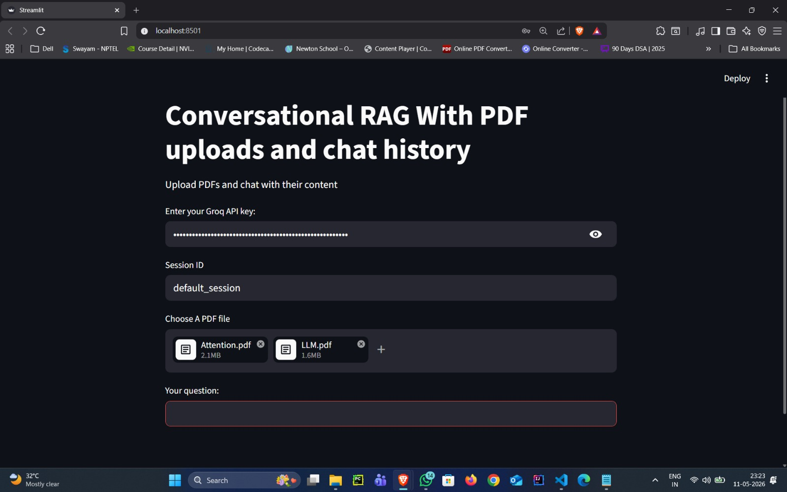
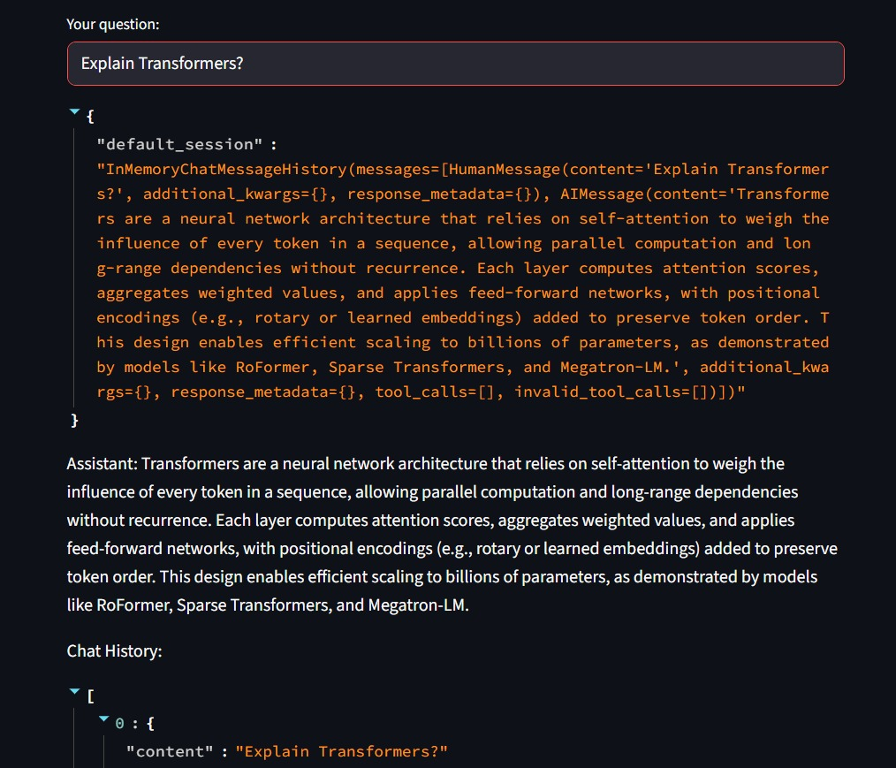
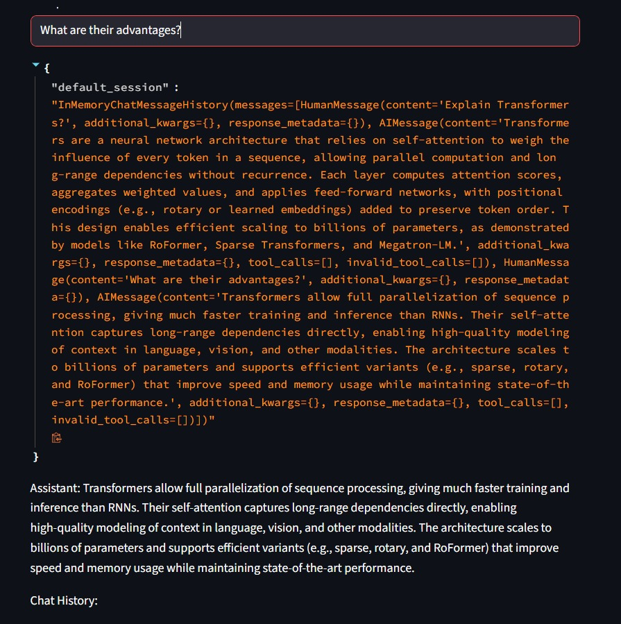
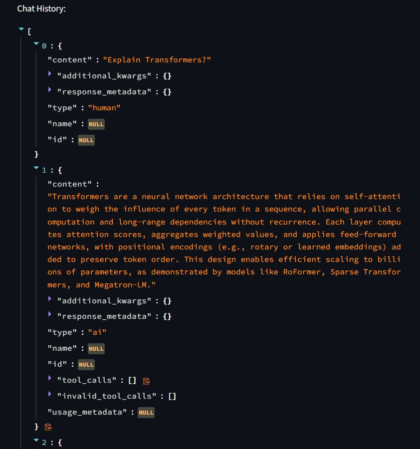
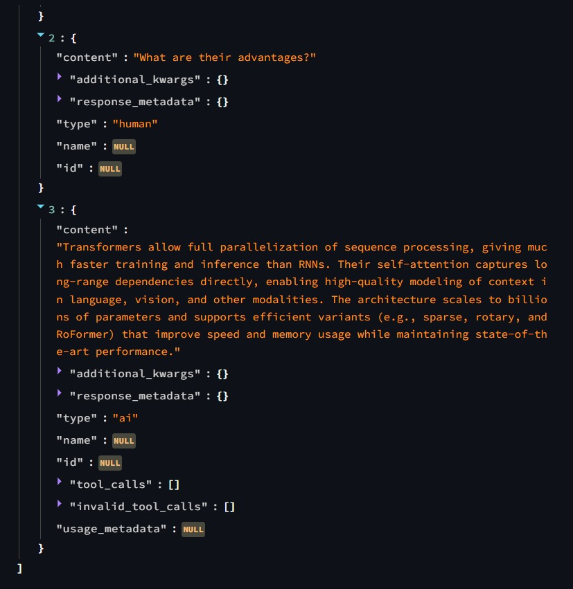

# Conversational RAG Chatbot with PDF and Memory

A Conversational Retrieval-Augmented Generation (RAG) chatbot built using LangChain, Groq, ChromaDB, HuggingFace Embeddings, and Streamlit.

This project allows users to upload PDF documents, ask questions about them, and continue conversations with memory-aware and context-aware responses using conversational RAG pipelines.

---

# Features

- Upload and chat with PDF documents
- Conversational memory with chat history
- History-aware retrieval for follow-up questions
- Semantic search using vector embeddings
- Context-aware responses using Groq LLMs
- Built using LCEL (LangChain Expression Language)
- Session-based conversation management
- Interactive Streamlit UI

---

# Tech Stack

- Python
- Streamlit
- LangChain
- Groq API
- ChromaDB
- HuggingFace Embeddings
- PyPDF
- LCEL (LangChain Expression Language)

---

# Project Structure

```text
conversational-rag-chatbot-with-pdf-and-memory/
│
├── app.py
├── requirements.txt
├── README.md
├── .env
├── .gitignore
│
├── screenshots/
│   ├── 0-home-page.jpeg
│   ├── 1-pdf-upload.jpeg
│   ├── 2-first-query-response.jpeg
│   ├── 3-second-query-response.jpeg
│   ├── 4-chat-history-1.jpeg
│   └── 5-chat-history-2.jpeg
```

---

# Application Screenshots

## Home Page



---

## PDF Upload



---

## First Query Response



---

## Follow-Up Question Response



---

## Chat History Memory



---

## Session Chat History



---

# How It Works

## Step 1: Upload PDF Documents

Users upload one or more PDF files through the Streamlit interface.

The PDFs are loaded using:

```python
PyPDFLoader
```

---

## Step 2: Split Documents

Documents are split into smaller chunks using:

```python
RecursiveCharacterTextSplitter
```

This improves:
- semantic retrieval
- embedding quality
- context handling

---

## Step 3: Generate Embeddings

Each document chunk is converted into vector embeddings using:

```python
HuggingFaceEmbeddings
```

Embedding model used:

```text
all-MiniLM-L6-v2
```

---

## Step 4: Store Embeddings in ChromaDB

The embeddings are stored in a Chroma vector database for semantic similarity search.

---

## Step 5: Conversational Retrieval

The chatbot combines:
- conversational memory
- chat history
- semantic retrieval
- contextual query reformulation

to answer follow-up questions intelligently.

Example:

```text
Explain transformers
→ What are their advantages?
→ Who introduced them?
```

The system understands contextual references using history-aware retrieval.

---

## Step 6: Generate Final Response

Retrieved context is passed to the Groq LLM using LCEL pipelines to generate context-aware answers.

---

# LCEL Conversational RAG Pipeline

```python
history_aware_retriever = (
    contextualize_q_prompt
    | llm
    | StrOutputParser()
    | retriever
)

rag_chain = (
    RunnablePassthrough.assign(
        context=history_aware_retriever | format_docs
    )
    | qa_prompt
    | llm
    | StrOutputParser()
)
```

---

# Concepts Used

- Conversational RAG
- History-Aware Retrieval
- Conversational Memory
- Semantic Search
- Vector Databases
- ChromaDB
- LCEL Pipelines
- Prompt Engineering
- Query Reformulation
- HuggingFace Embeddings

---

# Setup Instructions

## 1. Clone Repository

```bash
git clone https://github.com/shaik-zaid/conversational-rag-chatbot-with-pdf-and-memory.git

cd conversational-rag-chatbot-with-pdf-and-memory
```

---

## 2. Create Virtual Environment

### Conda

```bash
conda create -p venv python=3.10 -y

conda activate ./venv
```

---

## 3. Install Dependencies

```bash
pip install -r requirements.txt
```

---

## 4. Add Environment Variables

Create a `.env` file:

```env
HF_TOKEN=your_huggingface_token

GROQ_API_KEY=your_groq_api_key
```

---

# Run the Application

```bash
streamlit run app.py
```

---

# Example Questions

- Explain transformers
- What is self-attention?
- What are the applications of LLMs?
- Summarize the uploaded document
- What are their advantages?
- Who introduced transformers?

---

# Future Improvements

- Persistent vector database
- Streaming responses
- Source citation highlighting
- Hybrid retrieval
- Multi-user authentication
- Advanced conversational memory
- Agentic workflows

---

# Learning Outcome

This project helped in understanding:
- how conversational memory works in RAG systems
- how history-aware retrieval improves follow-up question handling
- how LCEL pipelines operate internally
- how retrieval and prompting work together in modern LLM systems

---

# Acknowledgements

Grateful to Krish Naik’s course:

**Complete Generative AI Course with LangChain and Hugging Face**

for helping build strong fundamentals in:
- LangChain
- Conversational AI
- RAG systems
- Memory-aware pipelines

---

# Author

Shaik Zaid

---

# License

This project is open-source and available under the MIT License.